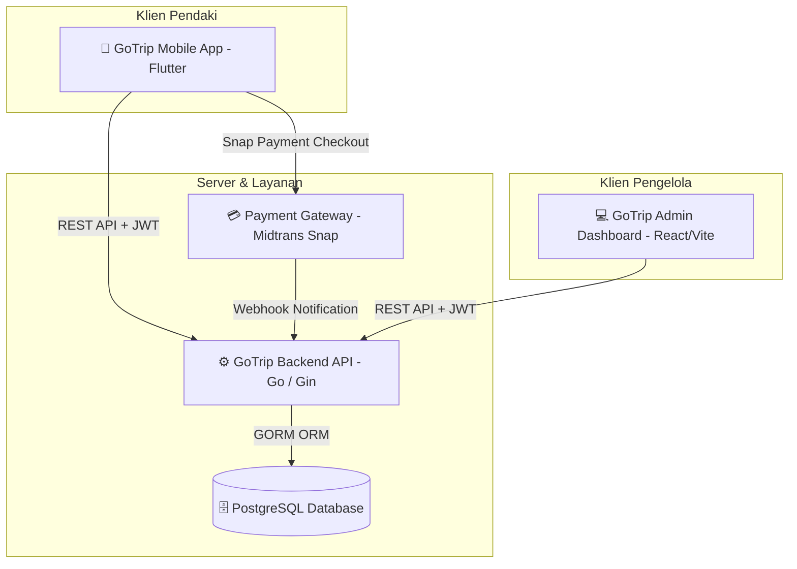

# 🏔️ GoTrip - Sistem Reservasi & Navigasi Pendakian Gunung Terintegrasi

<div align="center">


<p align="center">
  Solusi terpadu manajemen tiket, verifikasi pembayaran digital, pemantauan pos check-in/out, serta navigasi rute pendakian berbasis mobile GPS (Studi Kasus: Jalur Pendakian Gunung Sumbing).
</p>

</div>

---

## 📌 Daftar Isi

1. [Tentang Proyek](#-tentang-proyek)
2. [Arsitektur Sistem](#-arsitektur-sistem)
3. [Fitur Utama](#-fitur-utama)
4. [Teknologi yang Digunakan](#-teknologi-yang-digunakan)
5. [Struktur Direktori Repositori](#-struktur-direktori-repositori)
6. [Panduan Instalasi & Menjalankan](#-panduan-instalasi--menjalankan)
   - [Persyaratan Sistem](#persyaratan-sistem)
   - [1. Backend API (Go)](#1-backend-api-go)
   - [2. Admin Dashboard (React + Vite)](#2-admin-dashboard-react--vite)
   - [3. Mobile App (Flutter)](#3-mobile-app-flutter)
7. [Variabel Lingkungan (Environment Variables)](#-variabel-lingkungan-environment-variables)
8. [Dokumentasi & Diagram Teknis](#-dokumentasi--diagram-teknis)
9. [Keamanan & Praktik Terbaik](#-keamanan--praktik-terbaik)
10. [Kontributor & Lisensi](#-kontributor--lisensi)

---

## 📖 Tentang Proyek

**GoTrip** adalah platform ekosistem pendakian gunung yang menghubungkan antara pendaki gunung dan pihak pengelola *basecamp*. Sistem ini bertujuan untuk mengatasi permasalahan registrasi manual, antrean di pos registrasi, validasi bukti transfer manual, pemantauan keselamatan pendaki di jalur, serta pencatatan keluar-masuk pendaki secara real-time.

Proyek ini dibangun secara modular dalam satu repositori (*monorepo*) yang mencakup:
- **`gotrip`**: Aplikasi mobile untuk pendaki (booking tiket, e-ticket QR, pembayaran Midtrans, peta rute GPS Gunung Sumbing).
- **`gotrip-backend`**: RESTful API berkinerja tinggi menggunakan Go (Gin) dengan database PostgreSQL, integrasi Midtrans Snap, enkripsi JWT, dan generator QR/PDF.
- **`gotrip-admin`**: Dashboard web interaktif bagi pengelola basecamp untuk verifikasi transaksi, monitoring pendaki, validasi tiket, dan rekapitulasi data.
- **`docs`**: Dokumentasi Tugas Akhir, Activity Diagram, dan Sequence Diagram arsitektur sistem.

---

## 🏗️ Arsitektur Sistem



---

## ✨ Fitur Utama

### 📱 1. GoTrip Mobile App (Pendaki)
- **Autentikasi & Profil**: Registrasi akun pendaki, login JWT, dan manajemen data diri pendaki.
- **Reservasi Tiket Pendakian**: Pemilihan tanggal pendakian, jumlah anggota tim, serta pemilihan pos rute (Gunung Sumbing).
- **Pembayaran Fleksibel**:
  - Otomatis: Integrasi Midtrans Snap (Virtual Account, QRIS, GoPay, dll.).
  - Manual: Unggah bukti transfer langsung dari kamera / galeri galeri ke server.
- **E-Ticket Digital**: Tiket elektronik otomatis dengan QR Code unik setelah pembayaran terverifikasi.
- **Navigasi & Jalur GPS**: Peta interaktif jalur pendakian (*offline-ready*) dengan panduan titik pos (*waypoints*) dan koordinat GPS.
- **Riwayat & Informasi Cuaca**: Riwayat pemesanan tiket dan widget informasi perkiraan cuaca pendakian.

### 💻 2. GoTrip Admin Dashboard (Pengelola Basecamp)
- **Ringkasan Dashboard**: Grafik statistik jumlah pendaki harian/bulanan dan rekap pendapatan.
- **Verifikasi Pembayaran**: Tinjau bukti transfer manual, setujui atau tolak pembayaran dengan alasan.
- **Check-in & Check-out Scanner**: Pemindaian barcode tiket pendaki di pos masuk dan pos keluar untuk memastikan keselamatan pendaki.
- **Manajemen Jalur & Pos**: Pengelolaan kuota harian, status buka/tutup jalur pendakian.
- **Ekspor Laporan**: Fitur unduh laporan pemesanan dan tiket dalam format **PDF** dan **CSV**.

### ⚙️ 3. GoTrip Backend API
- **High Performance API**: Dibangun dengan Go 1.24 dan Gin framework yang ringan dan cepat.
- **Otorisasi Berbasis Peran (RBAC)**: Middleware pemisah akses antara role `pendaki` dan `admin`.
- **Keamanan Data**: Hashing password menggunakan `bcrypt` dan token otorisasi `JWT`.
- **Midtrans Webhook Receiver**: Sinkronisasi status transaksi otomatis (settlement, pending, expired, cancel).
- **Generator Dokumen**: Pembuatan kode QR otomatis dan export laporan PDF (`gofpdf`).

---

## 🛠️ Teknologi yang Digunakan

| Komponen | Bahasa / Framework | Pustaka Utama |
| :--- | :--- | :--- |
| **Backend** | Go (Golang) 1.24 | Gin Gonic, GORM, PostgreSQL Driver, godotenv, golang-jwt, gofpdf |
| **Mobile App** | Dart / Flutter 3.x | GetX, flutter_map, latlong2, geolocator, mobile_scanner, dio |
| **Web Admin** | JavaScript / React 19 | Vite, React Router DOM, Axios, Recharts, Tailwind CSS |
| **Database** | PostgreSQL | Relational Database Management System |
| **Third-Party** | Payment & Tools | Midtrans Snap API, OpenStreetMap Tile Server |

---

## 📁 Struktur Direktori Repositori

```text
aplikasi/
├── .gitignore                   # Aturan pengabaian file sensitif & build
├── README.md                    # Dokumentasi utama proyek
├── docs/                        # Dokumen Tugas Akhir & Diagram UML
│   ├── 5220411377_TugasAkhir... # Naskah lengkap Tugas Akhir
│   ├── activity-diagram-dad.md  # Spesifikasi activity diagram
│   └── sequence-diagram-*.md    # Spesifikasi sequence diagram (User & Admin)
│
├── gotrip/                      # [MOBILE] Proyek Flutter GoTrip
│   ├── lib/
│   │   ├── config/              # Konfigurasi endpoint API
│   │   ├── controller/          # GetX Controllers (Booking, Auth, Route, dll)
│   │   ├── model/               # Data models
│   │   └── view/                # Tampilan layar UI mobile
│   └── pubspec.yaml             # Manajemen dependencies Flutter
│
├── gotrip-admin/                # [WEB] Dashboard Admin React + Vite
│   ├── .env.example             # Template konfigurasi environment web
│   ├── src/
│   │   ├── api/                 # Konfigurasi Axios & interseptor JWT
│   │   ├── components/          # Komponen UI reusable
│   │   └── pages/               # Halaman dashboard, verifikasi, & laporan
│   └── package.json             # Manajemen dependencies Node.js
│
└── gotrip-backend/              # [BACKEND] REST API Go + Gin
    ├── .env.example             # Template variabel lingkungan backend
    ├── config/                  # Konfigurasi Database & Environment
    ├── controllers/             # Handler HTTP (Auth, Booking, Payment, Ticket)
    ├── middlewares/             # Middleware JWT & Validasi Role
    ├── models/                  # Struktur tabel database (GORM)
    ├── routes/                  # Definisi routing API Gin
    ├── services/                # Logika bisnis (Midtrans, QR, Export)
    └── main.go                  # Entrypoint server backend
```

---

## 🚀 Panduan Instalasi & Menjalankan

### Persyaratan Sistem
- **Go**: Versi 1.24 atau lebih baru
- **Node.js**: Versi 18.x atau lebih baru (npm / yarn)
- **Flutter SDK**: Versi 3.x atau lebih baru
- **PostgreSQL**: Versi 14 atau lebih baru

---

### 1. Backend API (Go)

1. Masuk ke direktori backend:
   ```bash
   cd gotrip-backend
   ```
2. Salin template environment dan sesuaikan kredensial database Anda:
   ```bash
   cp .env.example .env
   ```
   > Edit file `.env` dan masukkan detail PostgreSQL serta kunci Midtrans Anda.

3. Unduh seluruh dependencies Go:
   ```bash
   go mod download
   ```
4. Jalankan server backend (otomatis melakukan auto-migration database):
   ```bash
   go run main.go
   ```
   Server akan aktif di `http://localhost:8080`.

---

### 2. Admin Dashboard (React + Vite)

1. Masuk ke direktori frontend admin:
   ```bash
   cd gotrip-admin
   ```
2. Buat file `.env` dari template:
   ```bash
   cp .env.example .env
   ```
3. Pasang seluruh dependencies:
   ```bash
   npm install
   ```
4. Jalankan development server:
   ```bash
   npm run dev
   ```
   Buka peramban di alamat yang tertera (biasanya `http://localhost:5173`).

---

### 3. Mobile App (Flutter)

1. Masuk ke direktori aplikasi mobile:
   ```bash
   cd gotrip
   ```
2. Konfigurasikan URL backend di `gotrip/lib/config/api_config.dart`:
   - Jika menggunakan emulator Android: gunakan `http://10.0.2.2:8080`
   - Jika menggunakan perangkat fisik: gunakan IP LAN komputer Anda (contoh: `http://192.168.1.10:8080`)
3. Ambil paket dependencies Flutter:
   ```bash
   flutter pub get
   ```
4. Jalankan aplikasi pada perangkat/emulator:
   ```bash
   flutter run
   ```

---

## 🔐 Variabel Lingkungan (Environment Variables)

### Konfigurasi Backend (`gotrip-backend/.env`)

| Variabel | Deskripsi | Nilai Contoh |
| :--- | :--- | :--- |
| `DATABASE_DSN` | DSN koneksi PostgreSQL lengkap | `host=localhost user=postgres password=secret dbname=gotrip_db port=5432 sslmode=disable` |
| `DB_HOST` | Host database (fallback) | `localhost` |
| `DB_PORT` | Port database (fallback) | `5432` |
| `DB_USER` | Username PostgreSQL | `postgres` |
| `DB_PASSWORD` | Password PostgreSQL | `secret` |
| `DB_NAME` | Nama database | `gotrip_db` |
| `JWT_SECRET` | Kunci rahasia signing token JWT | `your-secret-key-gotrip-2025` |
| `MIDTRANS_SERVER_KEY` | Server Key Midtrans | `SB-Mid-server-xxxx` |
| `MIDTRANS_CLIENT_KEY` | Client Key Midtrans | `SB-Mid-client-xxxx` |
| `MIDTRANS_ENVIRONMENT` | Lingkungan Midtrans (`sandbox` / `production`) | `sandbox` |
| `MIDTRANS_NOTIFICATION_URL` | URL endpoint Webhook penerima status Midtrans | `https://yourdomain.com/api/payments/webhook` |
| `APP_BASE_URL` | Base URL server backend | `http://localhost:8080` |

---

## 📊 Dokumentasi & Diagram Teknis

Diagram alur sistem, rancangan basis data, dan interaksi aktor telah didokumentasikan secara rinci di dalam direktori [`docs/`](./docs/):
- **Activity Diagram**: [docs/activity-diagram-dad.md](./docs/activity-diagram-dad.md)
- **Sequence Diagram User**: [docs/sequence-diagram-user.md](./docs/sequence-diagram-user.md)
- **Diagram DrawIO Arsitektur**: `docs/gotrip-bab4-diagrams.drawio`

---

## 🛡️ Keamanan & Praktik Terbaik

- **Jangan Pernah Mengunggah File `.env`**: File konfigurasi `.env` berisi rahasia database dan API key. File ini telah dikecualikan di `.gitignore`. Selalu gunakan `.env.example` saat berbagi konfigurasi.
- **Folder `uploads/`**: File bukti transfer dan barcode pengguna dikelola secara lokal pada runtime server dan tidak dilacak di repositori publik demi privasi dan efisiensi ukuran repositori.
- **Keamanan Token**: Seluruh endpoint transaksi dan data pengguna dilindungi menggunakan header `Authorization: Bearer <token>`.

---

## 👨‍💻 Kontributor & Lisensi

Proyek ini dikembangkan oleh **[muhammadmuslim03](https://github.com/muhammadmuslim03)** untuk penelitian dan pengembangan sistem informasi pendakian gunung.

Didistribusikan di bawah lisensi terbuka untuk keperluan edukasi dan pengembangan profesional.
