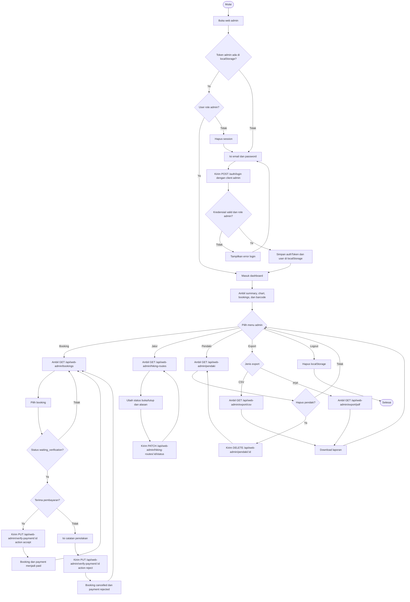
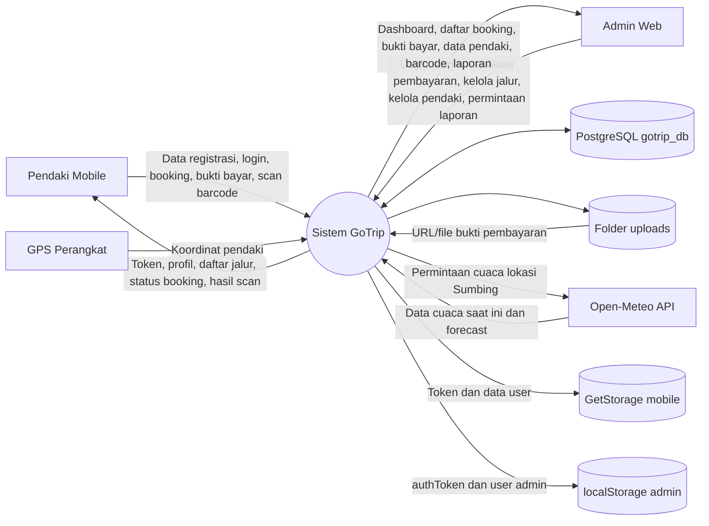
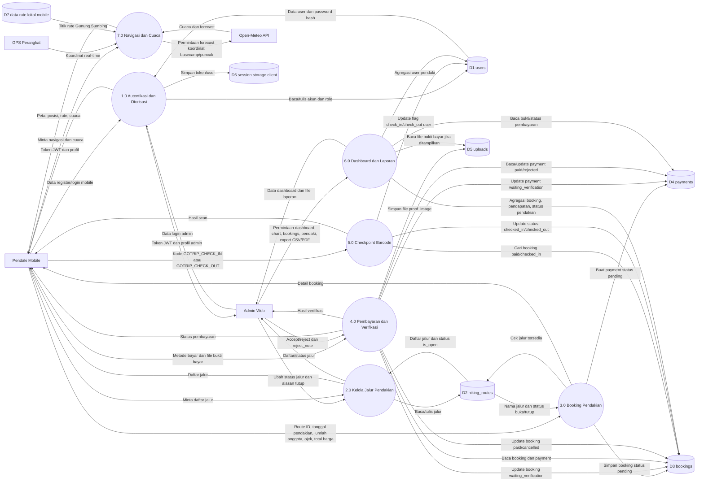
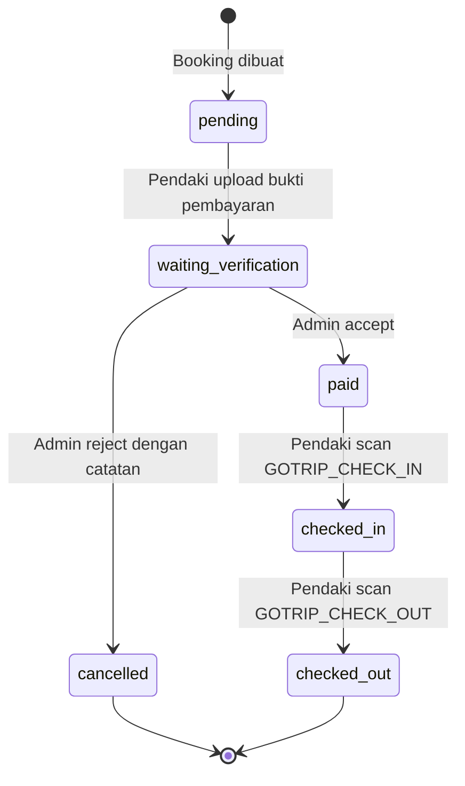

# Activity Diagram dan DAD GoTrip

Dokumen ini dibuat dari kode aplikasi GoTrip yang ada di repository ini. DAD pada dokumen ini dimaknai sebagai Diagram Arus Data.

## Ruang Lingkup Kode

Sumber utama yang dipakai:

- Backend API Go/Gin: `gotrip-backend/main.go`, `gotrip-backend/controllers/**`, `gotrip-backend/models/**`, `gotrip-backend/config/database.go`.
- Aplikasi mobile Flutter: `gotrip/lib/main.dart`, `gotrip/lib/controller/**`, `gotrip/lib/view/**`.
- Web admin React: `gotrip-admin/src/App.jsx`, `gotrip-admin/src/pages/**`, `gotrip-admin/src/api/**`, `gotrip-admin/src/contexts/AuthContext.jsx`.

Fitur utama yang tergambar:

- Registrasi dan login pendaki/admin.
- Pemesanan/booking pendakian.
- Upload bukti pembayaran.
- Verifikasi pembayaran oleh admin.
- Check-in dan check-out melalui scan barcode.
- Dashboard, grafik, data pendaki, pengaturan jalur, dan export laporan admin.
- Navigasi peta dan cuaca mobile dari GPS perangkat serta Open-Meteo.

## Activity Diagram - Pendaki Mobile

```mermaid
flowchart TD
    Start([Mulai]) --> OpenApp[Buka aplikasi GoTrip mobile]
    OpenApp --> HasAccount{Sudah punya akun?}

    HasAccount -- Tidak --> RegisterForm[Isi form registrasi pendaki]
    RegisterForm --> ValidateRegister[Validasi input registrasi]
    ValidateRegister --> RegisterValid{Input valid?}
    RegisterValid -- Tidak --> RegisterError[Tampilkan pesan gagal]
    RegisterError --> RegisterForm
    RegisterValid -- Ya --> RegisterAPI[Kirim POST /auth/register]
    RegisterAPI --> RegisterSaved[Simpan akun pendaki di tabel users]
    RegisterSaved --> LoginForm

    HasAccount -- Ya --> LoginForm[Isi email dan password]
    LoginForm --> ValidateLogin[Validasi input login]
    ValidateLogin --> LoginInputValid{Email dan password terisi?}
    LoginInputValid -- Tidak --> LoginError[Tampilkan pesan gagal]
    LoginError --> LoginForm
    LoginInputValid -- Ya --> LoginAPI[Kirim POST /auth/login dengan client mobile]
    LoginAPI --> AuthCheck{Kredensial valid dan role pendaki?}
    AuthCheck -- Tidak --> AuthRejected[Tampilkan error login]
    AuthRejected --> LoginForm
    AuthCheck -- Ya --> SaveMobileSession[Simpan token dan profil di GetStorage]
    SaveMobileSession --> Home[Masuk halaman home]

    Home --> LoadRoutes[Ambil daftar jalur GET /api/hiking-routes]
    LoadRoutes --> ChooseAction{Pilih aktivitas}

    ChooseAction -- Booking --> ChooseRoute[Pilih jalur, tanggal, jumlah pendaki, ojek]
    ChooseRoute --> BookingValidation{Data lengkap dan jalur terbuka?}
    BookingValidation -- Tidak --> BookingFormError[Tampilkan pesan validasi]
    BookingFormError --> ChooseRoute
    BookingValidation -- Ya --> CreateBooking[Kirim POST /api/bookings]
    CreateBooking --> BookingCreated[Buat booking status pending dan payment pending]
    BookingCreated --> PaymentScreen[Buka halaman upload bukti pembayaran]
    PaymentScreen --> ChoosePayment[Pilih metode pembayaran]
    ChoosePayment --> PickProof[Pilih gambar bukti bayar]
    PickProof --> PaymentValidation{Metode dan gambar tersedia?}
    PaymentValidation -- Tidak --> PaymentError[Tampilkan pesan gagal]
    PaymentError --> PaymentScreen
    PaymentValidation -- Ya --> UploadProof[Kirim PATCH /api/bookings/:id/proof]
    UploadProof --> WaitingVerification[Status booking dan payment menjadi waiting_verification]
    WaitingVerification --> History[Masuk riwayat booking]

    ChooseAction -- Riwayat --> History
    History --> GetHistory[Ambil GET /api/bookings]
    GetHistory --> ShowStatus[Tampilkan status booking]
    ShowStatus --> IsPaid{Status paid?}
    IsPaid -- Tidak --> ChooseAction
    IsPaid -- Ya --> ScanMenu[Buka tab scan]

    ChooseAction -- Scan --> ScanMenu
    ScanMenu --> ScanBarcode[Scan barcode check-in/check-out]
    ScanBarcode --> SendScan[Kirim POST /api/checkpoint/scan]
    SendScan --> BarcodeValid{Kode barcode valid?}
    BarcodeValid -- Tidak --> ScanFailed[Tampilkan error barcode]
    ScanFailed --> ScanMenu
    BarcodeValid -- Check-in --> CheckIn[Booking paid menjadi checked_in dan user check_in true]
    BarcodeValid -- Check-out --> CheckOut[Booking checked_in menjadi checked_out dan user check_out true]
    CheckIn --> RefreshHistory[Refresh riwayat]
    CheckOut --> RefreshHistory
    RefreshHistory --> ChooseAction

    ChooseAction -- Navigasi/Cuaca --> Navigation[Izinkan lokasi dan mulai tracking GPS]
    Navigation --> FetchWeather[Ambil cuaca dari api.open-meteo.com]
    FetchWeather --> ShowMap[Tampilkan peta, rute lokal, posisi, dan cuaca]
    ShowMap --> ChooseAction

    ChooseAction -- Profil/Logout --> Profile[Kelola profil atau logout]
    Profile --> Logout{Logout?}
    Logout -- Tidak --> ChooseAction
    Logout -- Ya --> ClearMobileSession[Hapus GetStorage]
    ClearMobileSession --> End([Selesai])
```

## Activity Diagram - Admin Web

## DAD - Diagram Konteks

## DAD - Level 1

## Data Store

| Kode | Nama | Sumber kode | Isi utama |
| --- | --- | --- | --- |
| D1 | `users` | `models.User` | ID, nama, email, password hash, phone, NIK, role, status check-in/check-out, timestamp. |
| D2 | `hiking_routes` | `models.HikingRoute` | ID jalur, nama jalur, deskripsi, `is_open`, `closed_reason`. |
| D3 | `bookings` | `models.Booking` | ID booking, user, jalur, tanggal booking/pendakian, jumlah anggota, total harga, ojek, status, catatan penolakan, waktu check-in/check-out. |
| D4 | `payments` | `models.Payment` | ID payment, booking, user, metode bayar, lokasi bukti bayar, status, catatan penolakan, waktu verifikasi. |
| D5 | `uploads` | `controllers/ticket/upload_proof.go` | File gambar bukti pembayaran yang disajikan lewat `/uploads`. |
| D6 | Session storage client | Flutter `GetStorage`, React `localStorage` | Token JWT dan data user untuk sesi mobile/admin. |
| D7 | Data rute lokal mobile | `gotrip/lib/data/sumbing_route_points.dart` | Titik koordinat jalur untuk navigasi peta mobile. |

## Status Booking dan Payment

Status payment mengikuti alur berikut:

- `pending`: payment dibuat bersamaan dengan booking.
- `waiting_verification`: bukti bayar berhasil diupload.
- `paid`: admin menerima pembayaran.
- `rejected`: admin menolak pembayaran; booking menjadi `cancelled`.

## Endpoint Utama yang Membentuk Diagram

| Area | Endpoint | Fungsi |
| --- | --- | --- |
| Auth | `POST /auth/register` | Registrasi pendaki. |
| Auth | `POST /auth/login` | Login mobile/admin dengan pembatasan role berdasarkan `client`. |
| Mobile | `GET /api/hiking-routes` | Mengambil daftar jalur pendakian. |
| Mobile | `POST /api/bookings` | Membuat booking dan payment awal. |
| Mobile | `GET /api/bookings` | Mengambil riwayat booking milik user login. |
| Mobile | `PATCH /api/bookings/:id/proof` | Upload bukti pembayaran dan metode bayar. |
| Mobile | `POST /api/checkpoint/scan` | Check-in/check-out berdasarkan barcode. |
| Admin | `GET /api/web-admin/dashboard` | Ringkasan dashboard. |
| Admin | `GET /api/web-admin/chart/pendapatan` | Chart pendapatan per bulan. |
| Admin | `GET /api/web-admin/chart/pendaki` | Chart akun pendaki per bulan. |
| Admin | `GET /api/web-admin/bookings` | Daftar seluruh booking beserta user dan payment. |
| Admin | `PUT /api/web-admin/verify-payment/:id` | Verifikasi atau tolak pembayaran. |
| Admin | `GET /api/web-admin/hiking-routes` | Daftar jalur untuk admin. |
| Admin | `PATCH /api/web-admin/hiking-routes/:id/status` | Buka/tutup jalur pendakian. |
| Admin | `GET /api/web-admin/pendaki` | Daftar akun pendaki. |
| Admin | `DELETE /api/web-admin/pendaki/:id` | Hapus akun pendaki. |
| Admin | `GET /api/web-admin/barcodes` | Ambil kode barcode check-in/check-out. |
| Admin | `GET /api/web-admin/export/csv` | Export data booking ke CSV. |
| Admin | `GET /api/web-admin/export/pdf` | Export data booking ke PDF. |

## Catatan dari Kode

- Flutter `ProfileController.updateProfile()` memanggil `PATCH /api/users/profile`, tetapi route tersebut belum terdaftar di `gotrip-backend/main.go`. Karena itu update profil tidak dimasukkan sebagai proses backend utama pada DAD.
- `NewsController` memakai data berita statis di sisi mobile dan URL gambar eksternal, bukan endpoint backend.
- Navigasi/cuaca mobile tidak menyimpan data ke backend. Controller memakai GPS perangkat, data titik rute lokal, dan `api.open-meteo.com`.
- Backend menyimpan CSV/PDF export sebagai file sementara di direktori kerja backend sebelum dikirim ke client.
