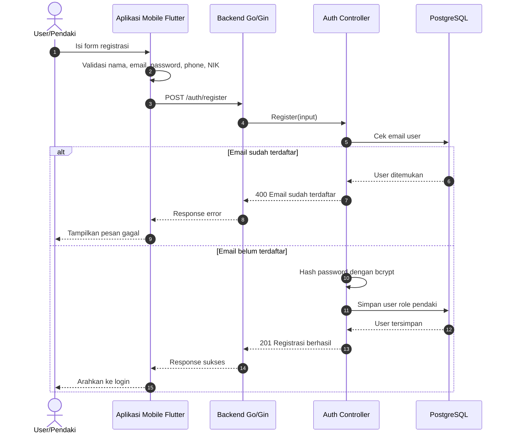
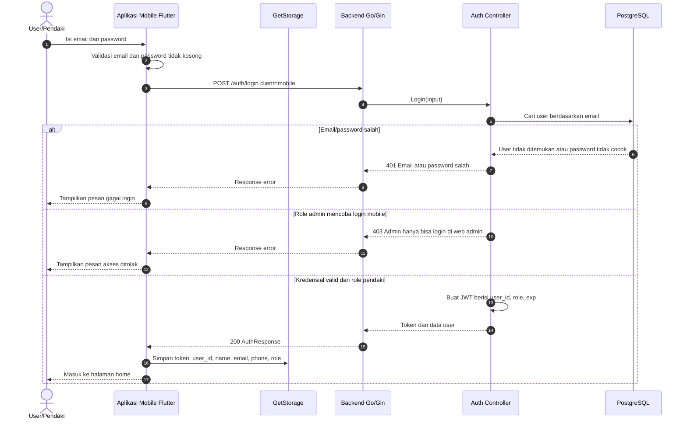
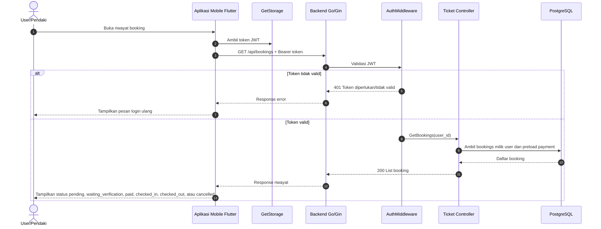
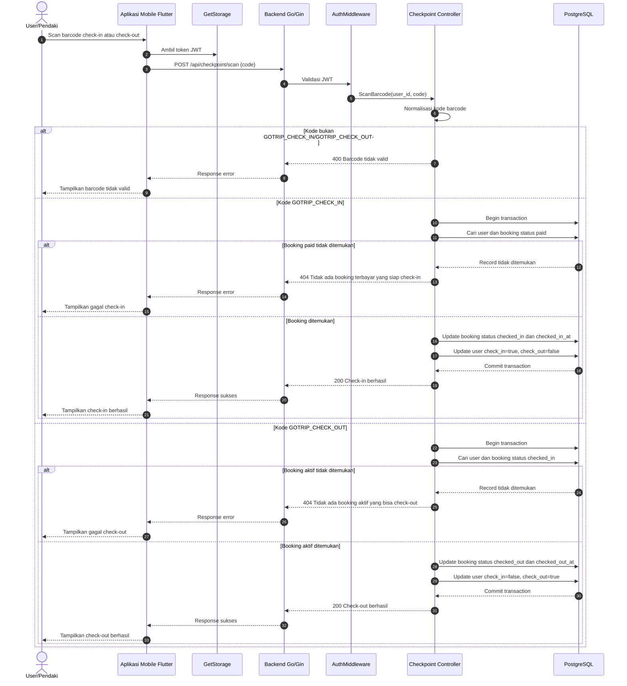
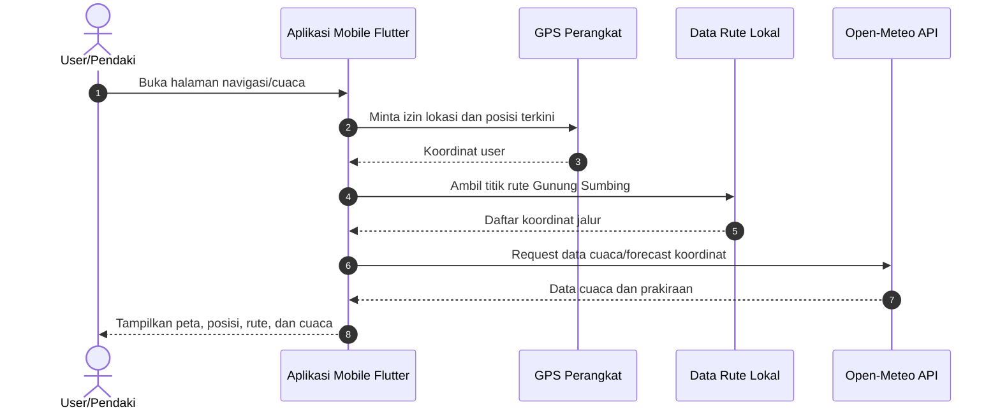
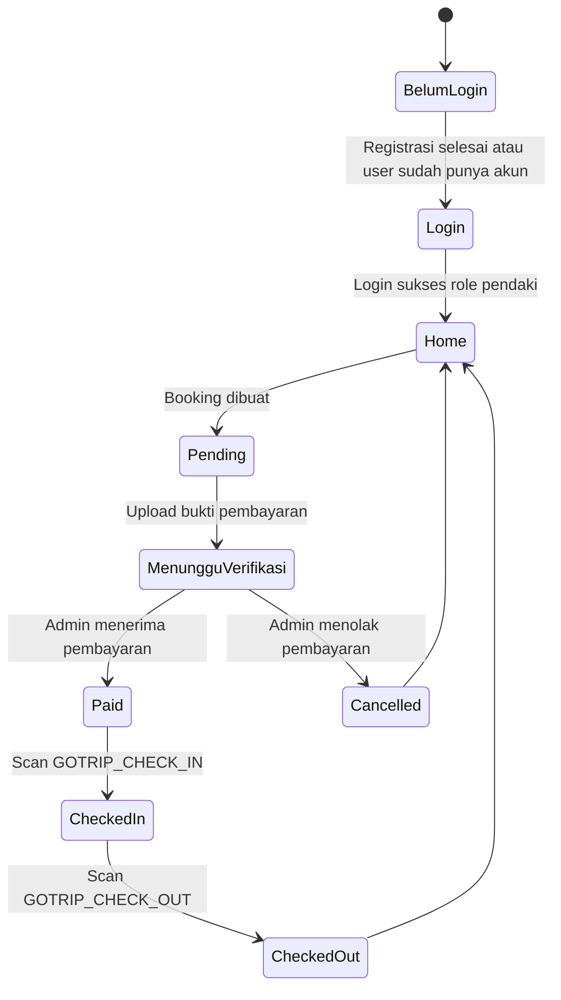

# Sequence Diagram User - GoTrip Mobile

Dokumen ini memisahkan sequence diagram untuk aktor user/pendaki pada aplikasi mobile GoTrip. Diagram dibuat dari alur kode Flutter di `gotrip/lib/controller/**` dan endpoint backend Go/Gin di `gotrip-backend/main.go` serta `gotrip-backend/controllers/**`.

## 1. Registrasi User

## 2. Login User Mobile

## 3. Booking Pendakian dan Upload Bukti Pembayaran

```mermaid
sequenceDiagram
    autonumber
    actor User as User/Pendaki
    participant Mobile as Aplikasi Mobile Flutter
    participant Storage as GetStorage
    participant API as Backend Go/Gin
    participant MW as AuthMiddleware
    participant Ticket as Ticket Controller
    participant Uploads as Folder uploads
    participant DB as PostgreSQL

    User->>Mobile: Pilih jalur, tanggal, jumlah anggota, opsi ojek
    Mobile->>Mobile: Hitung total harga dan validasi form
    Mobile->>Storage: Ambil token JWT
    Mobile->>API: POST /api/bookings + Bearer token
    API->>MW: Validasi JWT

    alt Token tidak valid
        MW-->>API: 401 Token tidak valid
        API-->>Mobile: Response error
        Mobile-->>User: Minta login ulang
    else Token valid
        MW->>Ticket: CreateBooking(user_id, input)
        Ticket->>DB: Cari hiking_routes berdasarkan route_id

        alt Jalur tidak ditemukan atau ditutup
            DB-->>Ticket: Data jalur tidak valid
            Ticket-->>API: 400 Jalur tidak tersedia
            API-->>Mobile: Response error
            Mobile-->>User: Tampilkan pesan gagal booking
        else Jalur terbuka
            Ticket->>DB: Begin transaction
            Ticket->>DB: Simpan booking status pending
            Ticket->>DB: Simpan payment status pending
            DB-->>Ticket: Commit transaction
            Ticket-->>API: 201 Detail booking dan payment
            API-->>Mobile: Response booking berhasil
            Mobile-->>User: Buka halaman upload bukti pembayaran
        end
    end

    User->>Mobile: Pilih metode bayar dan gambar bukti
    Mobile->>Mobile: Validasi metode dan file bukti
    Mobile->>Storage: Ambil token JWT
    Mobile->>API: PATCH /api/bookings/:id/proof multipart
    API->>MW: Validasi JWT
    MW->>Ticket: UploadProof(booking_id, payment_method, proof_image)
    Ticket->>Uploads: Simpan file bukti pembayaran
    Ticket->>DB: Ambil booking beserta payment
    Ticket->>DB: Begin transaction
    Ticket->>DB: Update booking status waiting_verification
    Ticket->>DB: Update payment method, proof_image, status waiting_verification
    DB-->>Ticket: Commit transaction
    Ticket-->>API: 200 Bukti pembayaran berhasil diupload
    API-->>Mobile: Response sukses
    Mobile-->>User: Tampilkan status menunggu verifikasi
```

## 4. Melihat Riwayat Booking

## 5. Check-in dan Check-out Barcode

## 6. Navigasi dan Cuaca Mobile

## Ringkasan Status User

